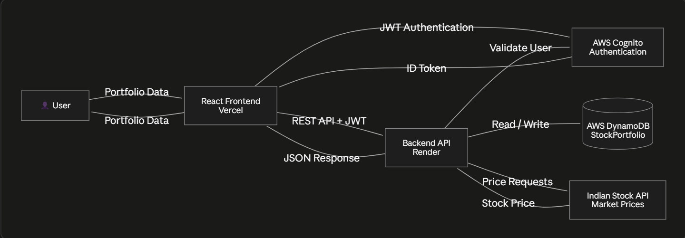

# Stock-portfolio-tracker

It is a SaaS platform where a user can keep track of their stock portfolio in a single website. This platform incorporates AWS for the backend and React for the frontend.

## Features

- Add and remove stocks from your portfolio
- View detailed historical graphs for a particular stock
- Maintain a watchlist to track specific stocks
- Browse the market page to check any stock's performance
- Secure login/register with AWS Cognito

## Tech stack used

1. **Frontend** — React.js (Vite)
2. **Backend** — Node.js/Express-style Lambda functions, AWS API Gateway
3. **Database** — DynamoDB (AWS)
4. **Auth** — AWS Cognito
5. **Stock data** — Indian API
6. **Hosting** — Vercel (frontend + backend)

## Project structure

```
stock-portfolio-tracker/
├── frontend/
│   └── src/
│       ├── assets/
│       ├── components/     # Navbar, ProtectedRoute, shared UI
│       ├── pages/          # Dashboard, Market, Watchlist, Auth pages, etc.
│       ├── services/       # API + auth helper functions
│       ├── App.jsx
│       ├── App.css
│       ├── aws-config.js   # Cognito configuration
│       ├── index.css
│       └── main.jsx
└── backend/
    └── src/
        ├── routes/
        │   └── investments.js
        ├── services/
        │   ├── auth.js
        │   └── dynamo.js
        └── app.js
```

## Setup guide

1. First create an account using the register page
2. Login using your credentials
3. Use the dashboard to add the stocks you currently want to track
4. Use the Watchlist page to keep an eye on specific stocks
5. Use the Market page to look at all stocks and their performance

## API Docs

Base URL: API Gateway endpoint (see AWS console). All routes below require a valid Cognito auth token unless noted otherwise.

### Investments

| Method | Endpoint | Description |
|--------|----------|-------------|
| GET | `/investments` | Get all investments for the logged-in user |
| POST | `/investments` | Add a new investment to the portfolio |
| GET | `/investments/{investmentId}` | Get details of a single investment |
| DELETE | `/investments/{investmentId}` | Remove an investment from the portfolio |

### Prices & History

| Method | Endpoint | Description |
|--------|----------|-------------|
| GET | `/prices` | Get current prices for tracked stocks |
| GET | `/prices/{symbol}` | Get the current price for a specific stock symbol |
| GET | `/history/{symbol}` | Get historical price data for a specific stock symbol |

### Stocks

| Method | Endpoint | Description |
|--------|----------|-------------|
| GET | `/stocks/search` | Search for stocks by name/symbol |

### Watchlist

| Method | Endpoint | Description |
|--------|----------|-------------|
| GET | `/watchlist` | Get the logged-in user's watchlist |
| POST | `/watchlist` | Add a stock to the watchlist |
| DELETE | `/watchlist/{symbol}` | Remove a stock from the watchlist |

> TODO: fill in request/response body examples for each endpoint (e.g. investment shape: `{ symbol, quantity, buyPrice, buyDate }`).

## .env example

```
INDIAN_API_KEY=XXXXXXXX
```

## Control flow and system architecture

